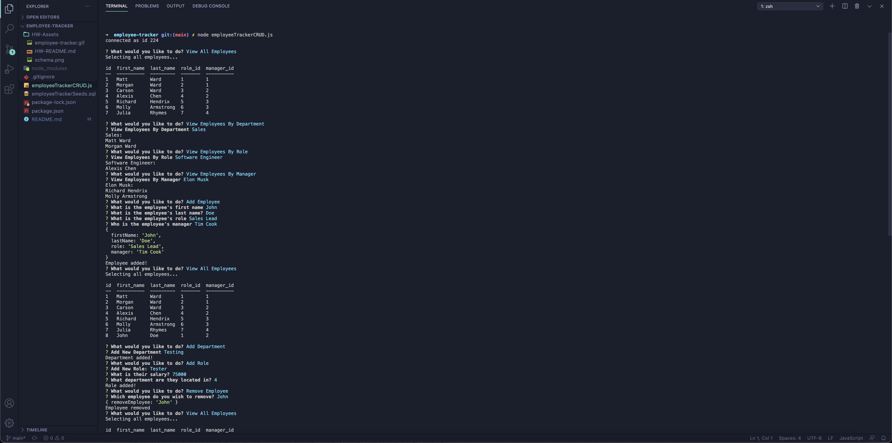

# Employee Tracker

## Approach 

This employee tracker application is comprised of many working parts that all seamlessly come together to build a polished, command line application that displays all of the employees of the company and details about them. These employee stats are then displayed in a table thanks to the use our of databse, MySQL. Schema's were built in MySQL to help me layout how the application would function and the ability to add, delete and join rows and tables together based of the user input when answering the prompts. The prompts were handled by the node module inquirer, this gives us the ability to prompt the user with questions, then store that information so it can be accesed and appended to our data where fit. This was the first time I have used the MySQL syntax in a JS file so that took some getting used to, once that was figured out it made this a much easier process. However, one of the biggest struggles was being able to prompt the user with strings that were being referenced by primary or non primary id's. This took multiple connection.queries and forEach loops for rawlist answers so that I was able to accomplish what was needed to meet all of the acceptance criteria. All of this comes together to make a user friendly, command line application that will generate a well laid out, first-rate employee tracker.

## Installation

To install this repo on your local drive you would have to clone the ssh key from my repo. Head into your local drive of choice in terminal or bash and do a git clone. Once you have done a git clone you are free to start working on this project. If you want to push your changes to my repo then you would have to head into terminal/bash and do a git add . Then a git commit -m explaning the changes made, and finally a git push to push the files onto the repo. 

## Usage 

If you want to use this program, first do a git clone as previously described. First do a npm inint -y to get a package.json file, from there we can start installing the dependencies needed for this project. The dependencies you will need are inquirer and mysql, console.table is an optional one as well. These are installed doing the corresponding npm installs. From there you can start working on this project as long as you have MySql and the MySql work bench insatlled. Now that your node modules are installed you can run this program in your integrated terminal by running the command, node employeeTrackerCRUD.js. This will start the program running, follow the prompts and you will have your employee tracker up and running. The following section has a demonstartion video.

## Finished project
 If you would like a demo of this program, visit https://youtu.be/s2cQnMxd1dY

## Features
<ul>
<li>A user can use this program to easily to generate a employee tracker that is nicey laid out and user friendly.</li>
<li>Uses the command line to accept the user input, utilizing the npm inquirer module.</li>
<li>The user is prompted to make selections including view all employees, view employees by department, view employees by role, view employees by manager, add employee, add department, add role, remove employee, update employee role, update employee manager, and EXIT.</li>
<li>When the user is done making a selection the the corresponding function is called thanks to a switch case.</li>
<li>The user can then pick another option and follow those prompts to complete it.</li>
<li>If they are done using the application there is an EXIT option that will take them out of the application.</li>
<li>Able to add department roles and employees to the corresponding tables.</li>
<li>Likewise the user view an employee based off their department, role or select to view all of the employees at one time. </li>
<li>If they want, to the user is able to delete an employee from the tracker. </li>
<li>All of the tables are built in MySQL workbench and that is used as the database for this application. </li>
<li>This schema and all of the queries are located in a seeds.sql file located in my editor.</li>
</ul>

## Tests
Using the MySQL workbench makes it possible to test your queries before entering them into the Javascript file. Better to test them there and make sure they work before spending the time building complex functions that might have bugs. If you test the queries in MySQL you atleast know the bug is not located in the query. 

## Credits
N/A

## Contributing

Pull requests are welcome and encouraged. Hit me up on my github <a href="https://github.com/mattrward1030">mattrward1030</a>

## Badges
 

## License

MIT License

Copyright (c) [2021] [Matthew Ward]

Permission is hereby granted, free of charge, to any person obtaining a copy
of this software and associated documentation files (the "Software"), to deal
in the Software without restriction, including without limitation the rights
to use, copy, modify, merge, publish, distribute, sublicense, and/or sell
copies of the Software, and to permit persons to whom the Software is
furnished to do so, subject to the following conditions:

The above copyright notice and this permission notice shall be included in all
copies or substantial portions of the Software.

THE SOFTWARE IS PROVIDED "AS IS", WITHOUT WARRANTY OF ANY KIND, EXPRESS OR
IMPLIED, INCLUDING BUT NOT LIMITED TO THE WARRANTIES OF MERCHANTABILITY,
FITNESS FOR A PARTICULAR PURPOSE AND NONINFRINGEMENT. IN NO EVENT SHALL THE
AUTHORS OR COPYRIGHT HOLDERS BE LIABLE FOR ANY CLAIM, DAMAGES OR OTHER
LIABILITY, WHETHER IN AN ACTION OF CONTRACT, TORT OR OTHERWISE, ARISING FROM,
OUT OF OR IN CONNECTION WITH THE SOFTWARE OR THE USE OR OTHER DEALINGS IN THE
SOFTWARE.
